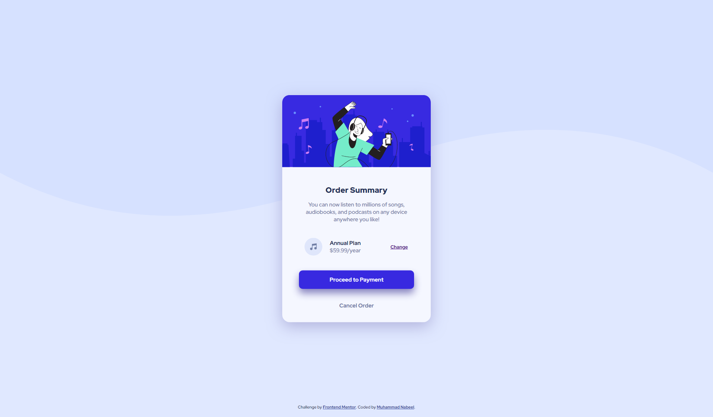
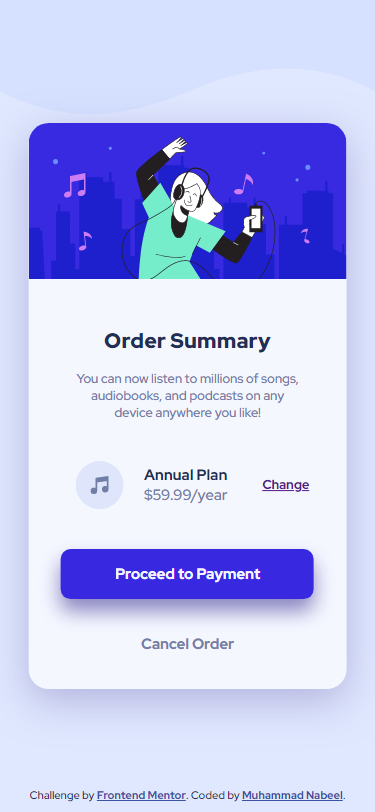
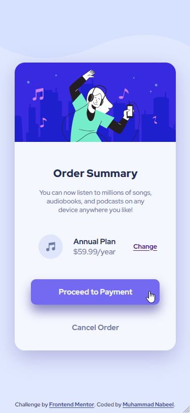

# Frontend Mentor - Order summary card solution

This is a solution to the [Order summary card challenge on Frontend Mentor](https://www.frontendmentor.io/challenges/order-summary-component-QlPmajDUj). 

## Table of contents

- [Frontend Mentor - Order summary card solution](#frontend-mentor---order-summary-card-solution)
  - [Table of contents](#table-of-contents)
  - [Overview](#overview)
    - [The challenge](#the-challenge)
    - [Screenshot](#screenshot)
      - [Hover States](#hover-states)
    - [Links](#links)
  - [My process](#my-process)
    - [Built with](#built-with)
    - [What I learned](#what-i-learned)
  - [Author](#author)

## Overview

### The challenge

Users should be able to:

- See hover states for interactive elements

### Screenshot

Desktop Version  

Mobile Version

#### Hover States

### Links

- [Solution URL](https://github.com/Muhammad-Nabeel-Sh/Order-Summary-Component-Challenge-Hub)
- [Live Site URL](https://muhammad-nabeel-sh.github.io/Order-Summary-Component-Challenge-Hub/)

## My process

### Built with

- Semantic HTML5 markup
- CSS 
- Flexbox
- CSS Variables

### What I learned

Throughout this challenge, I reinforced some frontend skills :

* Using `transform: translateX() | translateY();` to vertically position objects
* Using pseudo classes properly `:first-of-type` , `:last-of-type`, `:first-child` , `:last-child`
* Hover states
* Using **Github Pages**
* Documenting steps and learnt skills through this `README.MD` file
* Setting a default font size then using relative units `em` and `rem`
* Listing the color palette and assigning it to CSS variables
* Making a responsive UI for multiple screen sizes

## Author

- [Frontend Mentor](https://www.frontendmentor.io/profile/Muhammad-Nabeel-Sh)
- [LinkedIn](https://www.linkedin.com/in/muhammad-nabil-ibrahim-728b571b8/)
